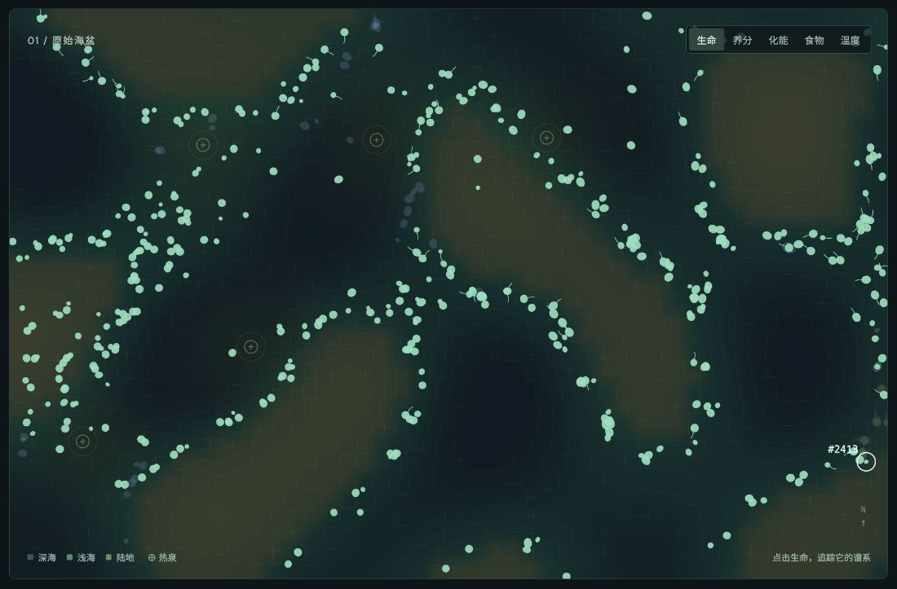
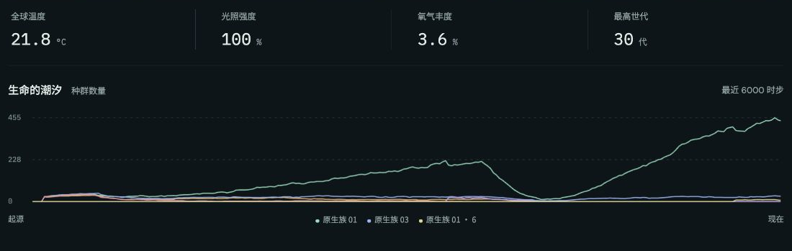
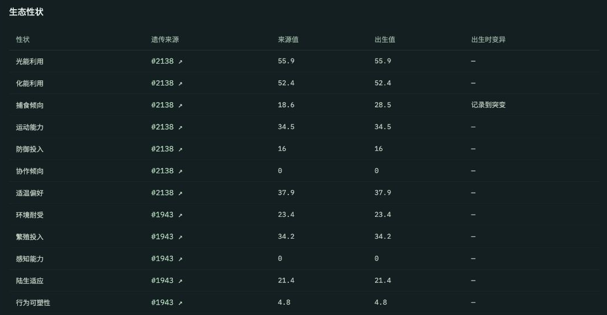
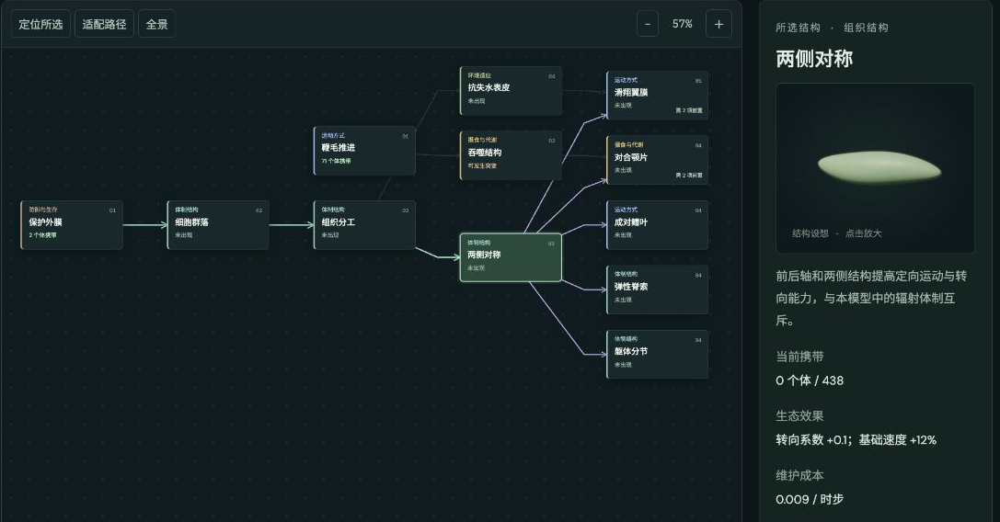
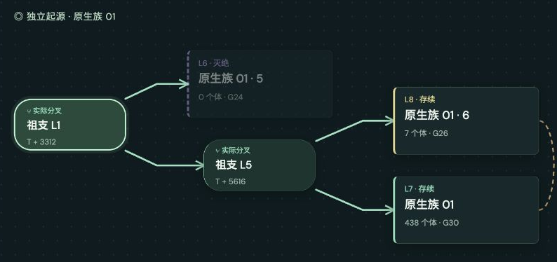
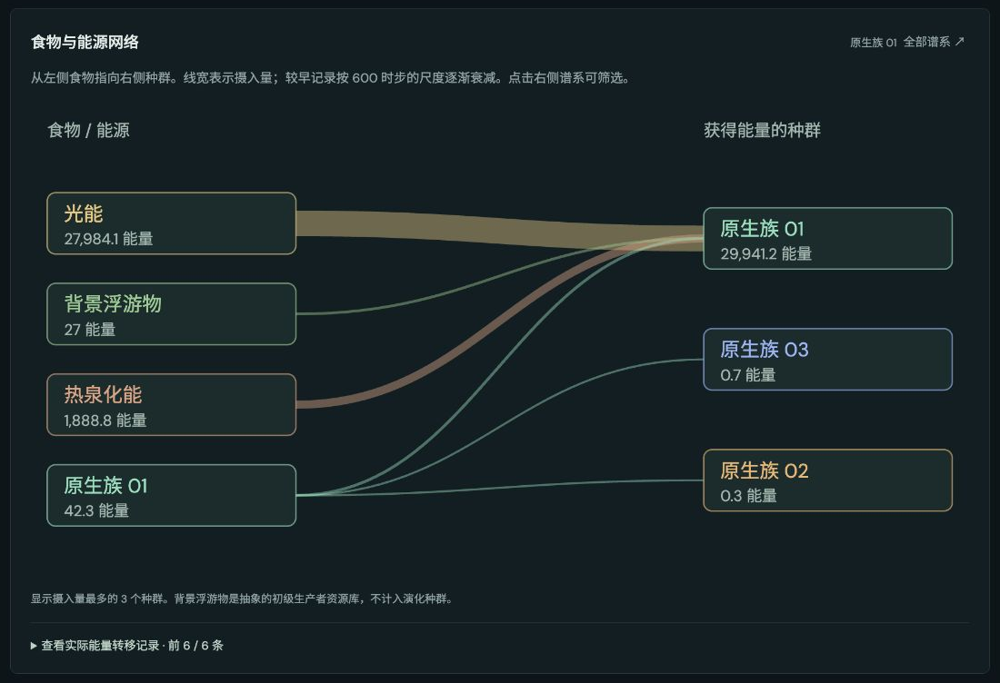
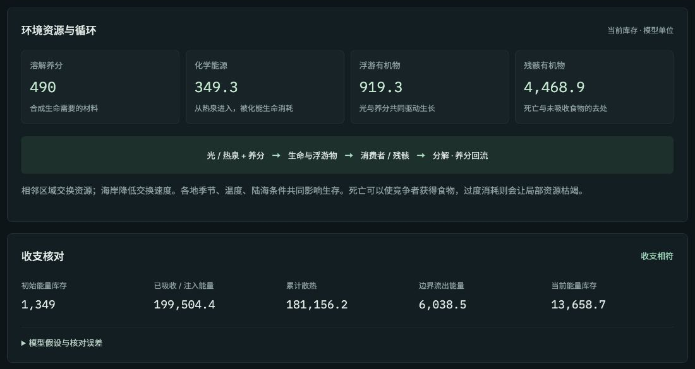
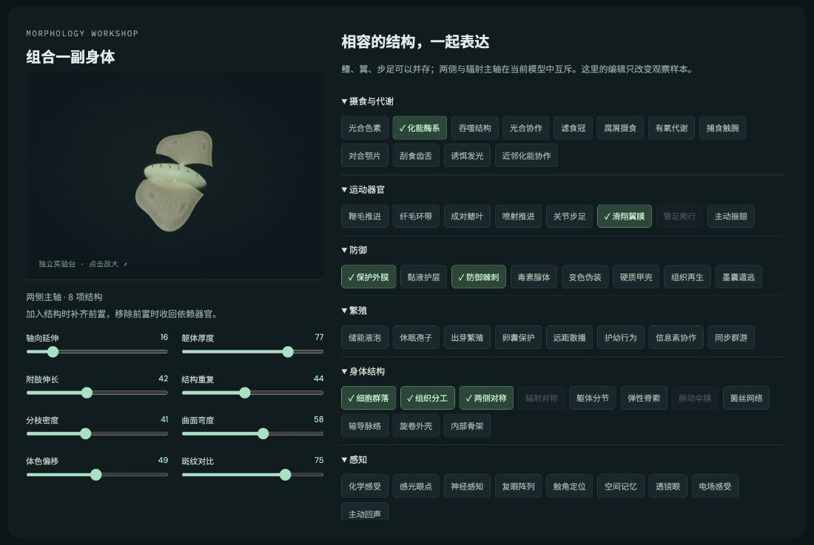
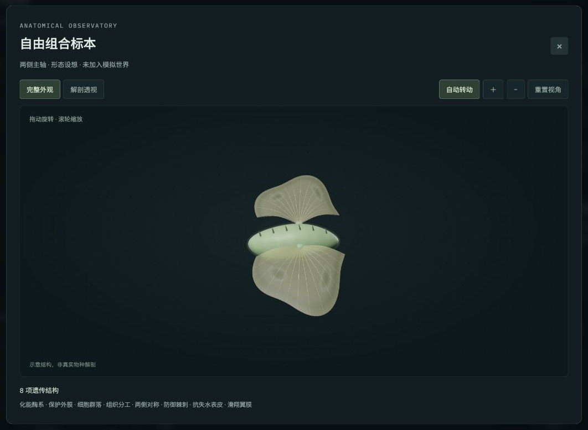
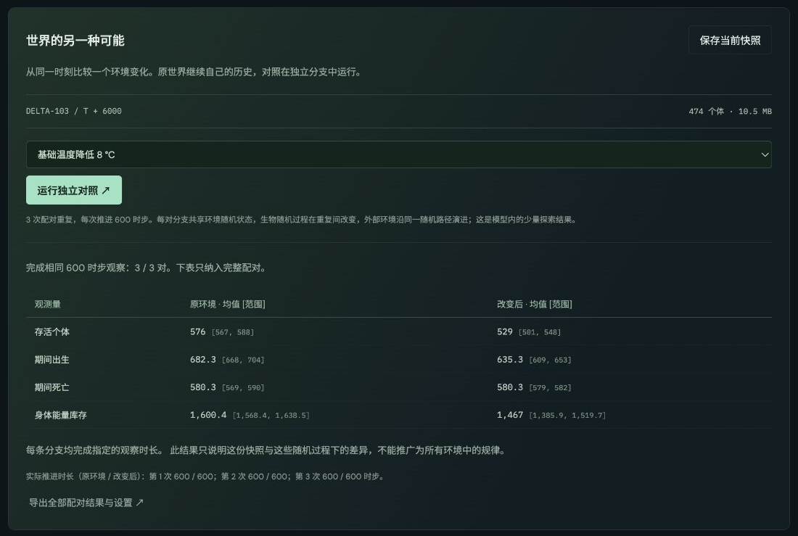

# 源海 · ORIGIN

**让生命自己寻找出路。一个在浏览器中持续演进的人工生命生态沙盒。**

源海把遗传、身体、资源和繁殖放进同一个世界：最初的复制者在海盆中摄取能量、移动、交配或单亲复制。后代继承亲本的性状，也可能发生变异；不同身体的收益与成本，随着环境和其他生命的变化影响它们留下多少后代。家系由此延续、分化或消失。

你可以改变这个世界的条件，也可以让它自行运行，追踪其中一个生命。看它从哪里来、身体如何形成、靠什么存活，再沿着亲缘、种群分支和食物网，了解它与整个生态系统的联系。

这里没有预设的物种进化路线，也没有必须抵达的复杂形态。可遗传差异在有限的发育规则中产生，演化方向由一次次生存与繁殖累积而成。

**[进入源海 · 在线体验 ↗](https://evolution-simulator.pages.dev/)** · [模型说明](docs/model-notes.md) · [验证记录](docs/validation.md)

以下世界截图来自种子 `DELTA-103` 在 T6000 的一次实际存档；它们呈现这条历史中的观察结果，不代表每次运行都会得到相同结果。组合实验台的设想标本另行注明。



*完整生态地图特写：生命分布在具有地形、温度与资源差异的海盆中，当前固定追踪个体 #2413。*

## 在源海可以做什么

| 想观察什么 | 可以怎样做 |
|---|---|
| 一个生态系统怎样建立、兴盛或衰退 | 创建世界，切换资源图层，观察种群数量、环境波动和灭绝事件。 |
| 改变环境后，哪些生命更容易延续 | 调整温度、光照、地质补给或海平面，也可以触发冰期、火山等事件。 |
| 一副身体的差异从哪里来 | 打开真实个体档案，比较亲子模型、遗传来源、出生变异和功能成本。 |
| 新的种群分支怎样出现 | 查看实际登记的分群历史、分化依据，以及分支之间仍在发生的交叉。 |
| 谁在生产，谁在消费 | 查看实际摄入构成的食物网、各谱系能量来源和资源循环收支。 |
| 同一套结构规则能形成什么身体 | 在独立组合实验台调整器官、比例与色纹，旋转模型并查看解剖透视。 |
| 同一世界在另一种条件下会怎样 | 保存快照，运行配对对照，或导出存档留待继续观察。 |

## 一个世界，多种观察距离

### 从海盆到一个生命

创建世界时，可以选择 **1–6 个初始谱系**，设置世界种子、起始繁殖方式和初始基因，并决定是否允许科幻性状。初始环境包括温度、光照、地质补给、海平面、突变率和自然环境波动。这些设置定义生命的起点与条件，后续历史继续由模拟产生。

生态现场提供 **生命、养分、化能、食物、温度** 五个地图图层。暂停、单步推进与 1× / 4× / 12× 速度让你自由切换观察节奏。地图下方的数量曲线保留最近的种群变化，侧栏可以追踪分群、查看遗传画像，并施加冰期、火山、营养涌流、海退、陨石或辐射干预。



*“生命的潮汐”展示完整的近期种群数量曲线。温度、光照、氧气丰度与最高世代一起呈现，帮助观察世界状态与种群变化。*

### 身体有来处，也有代价

每个生命都携带可遗传的生态参数、形态参数与结构性状。**12 项生态参数、8 项形态参数和 72 项结构性状**共同定义当前模型的发育空间，其中 7 项科幻性状可在创建世界时关闭。三维身体从这些性状组合中生成，亲本与后代可以拥有相似的身体结构，同时在比例、器官尺度和细节上产生差异。

在**生命档案**中，你可以固定追踪一个个体，观察身体、推进和保护结构，读取相应的功能与维护成本。体型、推进面积、附肢负担和保护厚度同时参与模型中的生存代价；体色与斑纹目前只影响外观。

档案保留出生方式、亲本、直接后代、死亡记录和实际能量收支。展开“遗传证据”，可以逐项查看性状来自哪个亲本、来源值与出生值是否不同，以及哪些结构在继承和变异中保留或丢失。亲子模型支持“等大观察”和“同一比例”，便于分别比较形状与体型。



*个体 #2413 的 12 项生态性状来源表：其中捕食倾向来自亲本 #2138，出生时由 18.6 变为 28.5，并记录为突变。历史个体死亡后，这些出生证据仍可追溯。*

### 看可能的结构，也看实际发生的分化

源海有两张用途不同的关系图。

**进化图谱**展示结构的前置、互斥、效果与维护成本。可以搜索能力，按类别筛选，查看完整图谱或只追踪所选结构的前置与后续。它回答的是：在当前发育规则中，一种结构怎样与其他结构相连？点击节点只用于观察，不会安排下一次变异。



*“两侧对称”的前置与后续，共 12 个节点。箭头连接结构依赖，多条入线表示需要共同具备；这里展示的是发育规则允许的关系。*

**种群分支**记录这一次世界中实际观察到的群体分化。分群要经过持续观察，并有存活新生后代等证据支持；名称与标签本身不决定交配。只要个体仍满足起源、遗传识别、繁殖方式与相遇等条件，不同分群之间依然可能留下后代。



*原生族 01 这一起源的完整分化路径：实线保留登记分群的历史，金色虚线标记实际发生过的跨分群交流。具体后代可进一步打开生命档案；没有交流记录本身不足以证明生殖隔离。*

### 追踪能量怎样穿过生态系统

生态网络把近期实际摄入绘成食物网：光能、热泉化能、背景浮游物、残骸和其他生命分别流向哪些种群。线宽反映摄入量，点击谱系可以筛选关系；生产与消费占比来自真实记录，同一谱系也可以同时利用多种来源。



*筛选原生族 01 后的食物与能源网络，按近期实际摄入量绘制。较早记录逐渐衰减，关系随生态历史变化。*

继续向下，可以看到各谱系的生产与消费比例、环境中的资源库存和循环过程。光照与热泉提供外部能量，生命利用养分建立身体；摄食转移能量，死亡与未同化食物进入残骸，分解回收养分，消耗以散热记入账目。出生所需的身体材料与储备由亲代支付。



*“环境资源与循环”和“收支核对”把当前库存与历史输入、散热和流出连接起来，便于检查生命活动的代价。*

### 探索性状组合能够长成的样子

**形态图鉴**中的世界标本取自真实个体；独立的**组合实验台**则用于探索规则允许的身体。你可以调整 8 项形态参数，添加或移除相容结构，观察鳍、翼、步足、保护层等怎样共同表达。添加结构会补齐前置，移除前置会收回依赖器官，互斥主轴受到限制。



*组合实验台编辑的是观察样本。它帮助理解结构与比例的关系，所生成的标本不会被加入正在运行的世界。*



*标本窗口支持旋转、缩放和解剖透视。实验台展示的复杂身体属于形态设想，并不意味着自然演化已产生了该形态。*

### 留下历史，比较另一种可能

在**观测记录**中保存快照，可以从同一时刻选择一次环境变化：降温、减少光照或增加地质补给。系统在后台运行 **3 次配对重复，每次计划推进 600 时步**，比较存活数量、期间出生与死亡，以及身体能量库存；触及计算容量的分支会提前停止，并在结果中标明。原世界继续保留自己的历史，对照结果可以连同起点、设置和原始记录一起导出。



*从 `DELTA-103` 的 T6000 快照出发，将基础温度降低 8°C，3/3 对均完成 600 时步。每对共享外部环境随机过程，不同重复改变生物随机过程；表中显示这三次重复的均值与范围。*

世界也可以随时导出为 JSON 存档，再导入继续运行；存档保留生命、资源、环境、亲缘证据和随机状态。页脚的“实验报告”可以导出当前世界的环境、谱系变化与最近事件。

## 让演化发生的机制

```text
亲本的可遗传差异
        ↓ 交叉 / 单亲复制 / 出生变异
后代的身体、能力与成本
        ↓ 摄食、移动、竞争、环境压力、繁殖机会
不同的存活与后代数量
        ↓
群体组成改变 → 持续分化留下谱系记录
        ↘ 生命活动也改变资源与其他个体的处境
```

变异提供差异，重组形成新的组合，资源与繁殖过程决定哪些差异被延续。个体使用趋食等启发式行为做出当下决策，不会规划未来的变异。较大、更复杂或更擅长某种活动的身体，也需要承担对应成本；世界可能出现扩张与分化，也可能长期由简单形态占优，或最终灭绝。

详细过程次序、分群依据、资源账目和参数假设见 [模型说明](docs/model-notes.md)。

## 科学边界

源海面向机制探索与科学传播，使用可检查的人工生命模型。当前验证针对程序的一致性、守恒和可复现性，尚未经过现实生态数据校准。

- “生命起源”从预置复制者开始；空间、时步与材料采用抽象单位。
- 登记分群是操作性的谱系分类。繁殖识别只模拟简化的交配前屏障，未模拟杂交后代不育。
- 发育空间来自有限性状目录；结构依赖和变异供给本身会造成偏置。当前最终测试世界主要由单体组成，尚未自然维持复杂多细胞生活史。
- 背景生产和分解仍使用资源方程；运动与身体功能是代理模型，未计算真实流体或胚胎发育。
- 三次对照的范围是这些重复的观测范围，不是置信区间。中性标记的自然变化同时受到突变、抽样和家系变化影响。
- 达到 2,200 个体会明确暂停；历史分群上限为 40。完整档案随历史增长，当前不保证无限运行。

## 本地运行

项目使用原生 JavaScript、CSS 和 HTML。网页文件与所需的 Three.js、Dagre 已放在 `dist/`，可以直接由静态服务器提供，无须构建。

```sh
git clone https://github.com/MXMX0811/evolution-simulator.git
cd evolution-simulator
python3 -m http.server 4173 --bind 127.0.0.1 --directory dist
```

随后打开 <http://127.0.0.1:4173/>。三维展示需要支持 WebGL 的现代浏览器；模拟在浏览器内运行。

运行自动检查（已在 Node.js 22 验证）：

```sh
npm ci
npm test
```

复现四个种子、四个条件、每轮最多 6,000 时步的数值检查：

```sh
node scripts/v5-benchmark.js --horizon=6000 --output=./results/v5
```

完整矩阵需要一定计算时间，结果写入 `results/`。较短的观察可使用 `--seeds=ORIGIN-042 --conditions=default --horizon=600`。部署目录与更新步骤见 [发布说明](docs/deployment.md)。

## 验证记录

v5 自动检查共 **72 项通过**。最终的 **16 轮**数值矩阵累计审计 **69,623 次出生**：未发现出生净造能、亲缘缺失或遗传来源错误，16 轮均通过存档恢复一致性检查。

默认、低温和富资源条件各 4/4 存续至 T6000，完全黑暗条件 4/4 灭绝；这些结论限于当前模型与固定样本。分类开关、只改色纹和翻转中性标记的独立检查，也用于确认观察标签及中性外观不会改变生态轨迹。方法、结果和限制见 [验证说明](docs/validation.md)。

## 项目结构

```text
dist/          可直接部署的网页与仿真模块
  vendor/      Three.js、Dagre 与对应许可证
tests/         遗传、生态、形态、关系图和观察检查
scripts/       数值实验与离线打包工具
docs/          模型说明、验证记录与项目截图
```

## 研究与项目参考

- [SLiM](https://messerlab.org/slim/)：个体遗传与明确的繁殖过程。
- [Westram 等，What is reproductive isolation?（2022）](https://research-explorer.ista.ac.at/download/12264/12448/2022_JourEvoBiology_Westram.pdf)：生殖隔离、空间背景和基因交流。
- [Sims，Evolving Virtual Creatures（1994）](https://www.karlsims.com/papers/siggraph94.pdf)：身体结构的遗传表达与部件连接。
- [Dingle 等（2024）](https://journals.plos.org/ploscompbiol/article?id=10.1371/journal.pcbi.1011893)：变异供给偏差如何影响形态演化。
- [ODD 模型描述协议（2020）](https://www.jasss.org/23/2/7.html)：公开目的、状态、过程次序和模型假设。
- [Thrive Auto-Evo](https://github.com/Revolutionary-Games/Thrive/blob/master/doc/auto_evo.md)、[ALIEN](https://github.com/chrxh/alien)、[The Sapling](https://thesaplinggame.com/)：资源生态位、功能性身体与持续观察的设计参考。

上述资料提供机制与呈现方面的参考；本项目没有复现这些工具的完整模型，参考文献也不代表当前参数经过论文校准。

三维渲染使用 [Three.js](https://threejs.org/)，关系布局使用 [Dagre](https://github.com/dagrejs/dagre)。第三方许可分别保留在 [THREE-LICENSE.txt](dist/vendor/THREE-LICENSE.txt) 与 [DAGRE-LICENSE.txt](dist/vendor/DAGRE-LICENSE.txt)。
