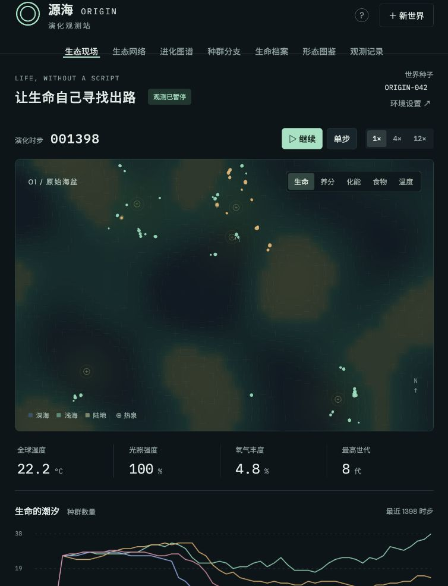
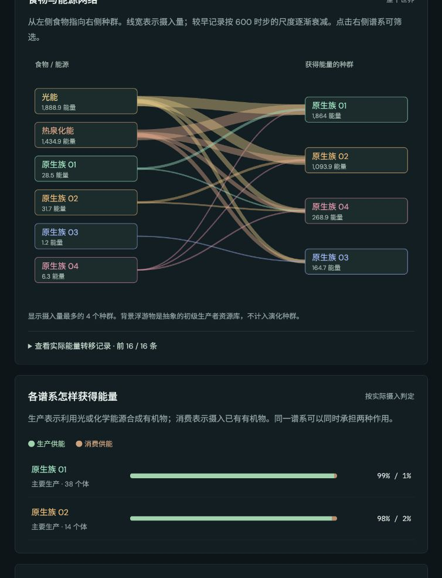
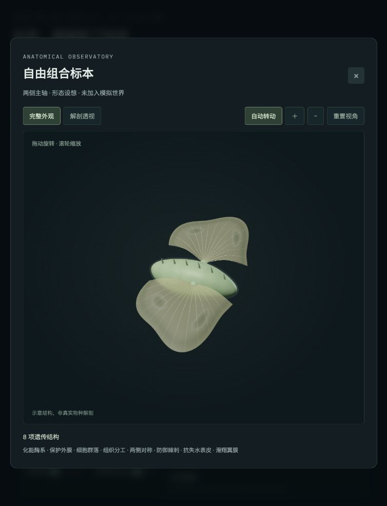

# 源海 · ORIGIN

**一个持续演进的人工生命生态沙盒。**

从最初的复制者出发，看生命摄取资源、繁殖、发生变异、形成家系，并在不断变化的环境中延续或消失。你可以改变环境，也可以只是观察：一个新生个体继承了什么，它的身体付出了什么代价，分化的种群是否还在交换基因。

没有固定的演化终点。世界中的差异来自遗传、相遇、资源与繁殖的共同作用；观察工具随时开放。

**[进入源海 · 在线体验 ↗](https://evolution-simulator.pages.dev/)** · [模型说明](docs/model-notes.md) · [验证记录](docs/validation.md)

Cloudflare Pages 公开托管，无需登录。



## 在这个世界里观察什么

| 观察入口 | 可以追踪的变化 |
|---|---|
| **生态现场** | 个体移动、摄食与繁殖，环境扰动，以及资源在空间中的分布。 |
| **生命档案** | 亲本与后代、逐位点继承、具体变异、出生结构、死亡记录与能量收支。 |
| **种群分支** | 有持续证据的群体分化，以及分支之间实际发生过的基因交流。 |
| **能量与食物网** | 光照、化学能源、生产、摄食、残骸和散热之间的实际流动。 |
| **形态图鉴** | 来自世界的个体与独立组合实验台；比较结构、体型和功能成本。 |
| **观测记录** | 保存世界快照，从同一起点改变一个环境条件，运行三次配对对照。 |



*食物网汇总实际摄入。一个种群可以同时利用多种能量来源，关系随世界变化。*

## 身体从可遗传的性状组合中生成

12 项生态参数、8 项形态参数与 72 项结构性状共同定义有限的发育空间。遗传、重组和变异改变这些组合，三维模型随之生成。性状受到结构依赖与互斥关系约束；创建世界时可以关闭其中 7 项科幻性状。

可见的身体也有成本。体型、附肢尺度、推进面积与保护厚度共同影响建造材料、维护、运动和防御；体色与斑纹目前只影响外观。亲子比较可以统一显示比例，区分形状变化和体型变化。



*组合实验台用于探索发育规则允许的身体。实验台中的复杂标本，不代表自然世界已经演化出了该形态。*

## 机制与证据

- **遗传可以追溯。** 每次成功出生记录亲本、位点来源、变异前后值和结构变化；死亡后仍保留档案。
- **分类跟随观察。** 群体差异必须持续存在，并具有新生后代证据，才登记为新分支。标签本身不改变交配、捕食或协作；兼容的分支仍可交流。
- **选择发生在生态过程中。** 有限资源、移动和维护成本、摄食能力、环境压力与繁殖共同影响后代数量。个体的趋食决策不规划下一次突变。
- **资源有账可查。** 亲代支付出生材料和储备；摄食转移能量，未同化物与死亡进入残骸，消耗产生散热并回收养分。
- **观察可以复现。** 世界种子和快照保存随机状态；独立对照在后台运行，并保留起点及原始结果。

详细规则、参数和抽象假设见 [模型说明](docs/model-notes.md)。

## 从哪里开始

打开世界，先让它运行一会儿。在生态现场选中一个个体，进入生命档案查看它的亲本与继承；再回到种群分支和能量页面，看看这条家系生活在怎样的生态关系中。

可以随时暂停、改变环境、保存或导入 JSON 存档。需要比较环境变化时，在观测记录中保存快照并运行配对对照。更长时间的观察也可能得到灭绝、简单形态占优或长期没有新分支的结果。

## 科学边界

源海面向机制探索与科学传播，使用的是可检查的人工生命模型。当前验证针对程序的一致性、守恒和可复现性，尚未经过现实生态数据校准。

- “生命起源”从预置复制者开始；空间、时步与材料采用抽象单位。
- 登记分群是操作性的谱系分类。繁殖识别只模拟简化的交配前屏障，未模拟杂交后代不育。
- 发育空间来自有限性状目录；结构依赖和变异供给本身会造成偏置。当前最终测试世界主要由单体组成，尚未自然维持复杂多细胞生活史。
- 背景生产和分解仍使用资源方程；运动与身体功能是代理模型，未计算真实流体或胚胎发育。
- 三次对照的范围是这些重复的观测范围，不是置信区间。中性标记的自然变化同时受到突变、抽样和家系变化影响。
- 达到 2,200 个体会明确暂停；历史分群上限为 40。完整档案随历史增长，当前不保证无限运行。

## 本地运行

项目是原生 JavaScript、CSS 和 HTML。网页文件与所需的 Three.js、Dagre 已放在 `dist/`，可直接由静态服务器提供，无须构建。

```sh
python3 -m http.server 4173 --bind 127.0.0.1 --directory dist
```

随后打开 <http://127.0.0.1:4173/>。三维展示需要支持 WebGL 的现代浏览器。模拟在浏览器内运行，保存世界时下载 JSON 文件。

运行自动检查（已在 Node.js 22 验证）：

```sh
npm ci
npm test
```

复现四个种子、四个条件、每轮最多 6,000 时步的数值检查：

```sh
node scripts/v5-benchmark.js --horizon=6000 --output=./results/v5
```

完整矩阵需要一定计算时间，结果写入 `results/`。一次较短的观察可使用 `--seeds=ORIGIN-042 --conditions=default --horizon=600`。

部署目录与更新步骤见 [Cloudflare 发布说明](docs/deployment.md)。

## 验证记录

v5 自动检查共 **72 项通过**。最终的 **16 轮**数值矩阵累计审计 **69,623 次出生**：未发现出生净造能、亲缘缺失或遗传来源错误，16 轮均通过存档恢复一致性检查。

默认、低温和富资源条件各 4/4 存续至 T6000，完全黑暗条件 4/4 灭绝；这些结论限于当前模型与固定样本。分类开关、只改色纹和翻转中性标记的独立检查，也用于确认观察标签及中性外观不会改变生态轨迹。方法、结果和限制见 [验证说明](docs/validation.md)。

## 项目结构

```text
dist/          可直接部署的网页与仿真模块
  vendor/      Three.js、Dagre 与对应许可证
tests/         遗传、生态、形态、关系图和观察检查
scripts/       数值实验与离线打包工具
docs/          模型说明、验证记录与项目截图
```

## 研究与项目参考

- [SLiM](https://messerlab.org/slim/)：个体遗传与明确的繁殖过程。
- [Westram 等，What is reproductive isolation?（2022）](https://research-explorer.ista.ac.at/download/12264/12448/2022_JourEvoBiology_Westram.pdf)：生殖隔离、空间背景和基因交流。
- [Sims，Evolving Virtual Creatures（1994）](https://www.karlsims.com/papers/siggraph94.pdf)：身体结构的遗传表达与部件连接。
- [Dingle 等（2024）](https://journals.plos.org/ploscompbiol/article?id=10.1371/journal.pcbi.1011893)：变异供给偏差如何影响形态演化。
- [ODD 模型描述协议（2020）](https://www.jasss.org/23/2/7.html)：公开目的、状态、过程次序和模型假设。
- [Thrive Auto-Evo](https://github.com/Revolutionary-Games/Thrive/blob/master/doc/auto_evo.md)、[ALIEN](https://github.com/chrxh/alien)、[The Sapling](https://thesaplinggame.com/)：资源生态位、功能性身体与持续观察的设计参考。

上述资料提供机制与呈现方面的参考；本项目没有复现这些工具的完整模型，参考文献也不代表当前参数经过论文校准。

三维渲染使用 [Three.js](https://threejs.org/)，关系布局使用 [Dagre](https://github.com/dagrejs/dagre)。第三方许可分别保留在 [THREE-LICENSE.txt](dist/vendor/THREE-LICENSE.txt) 与 [DAGRE-LICENSE.txt](dist/vendor/DAGRE-LICENSE.txt)。
