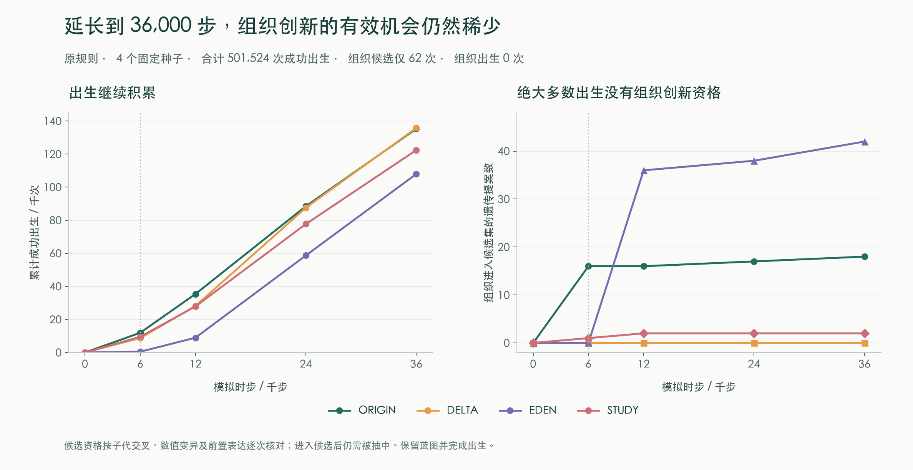
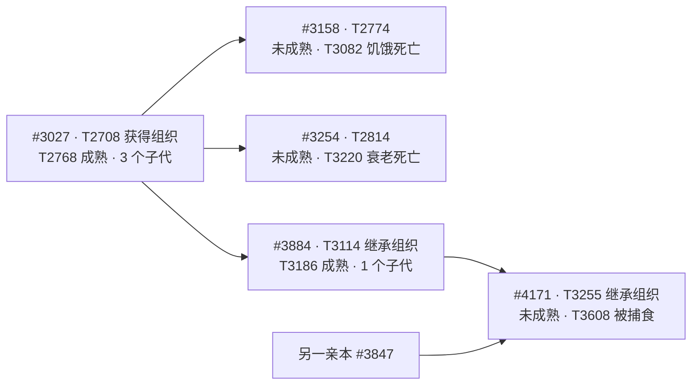
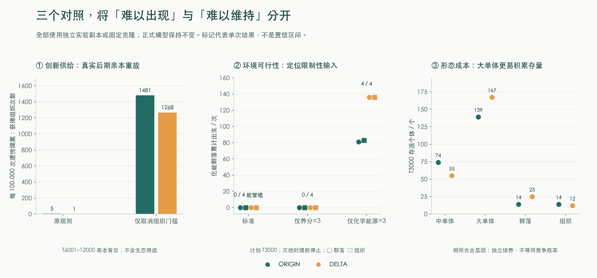

# v6 长时演化与创新瓶颈审计

本报告检查一个具体问题：**运行 6,000 步仍然没有出现复杂形态，究竟是等待时间不足，还是模型压低了复杂形态出现和延续的机会？**

审计日期：2026-09-30。被审计机制为 [v6 源码版本](https://github.com/MXMX0811/evolution-simulator/tree/103932a7faf0e8ba667933c9d5dd9b9a8717f784)。本轮增加观察脚本、实验和文档；门槛、资源等反事实只在实验副本中改变，产品中的演化规则尚未按这些结果调整。此前的能量核算与 v5/v6 比较见[验证报告](validation.md)。

四个默认世界均已运行到 36,000 步，合计发生 **501,524 次成功出生**，没有出现表达组织分工、两侧对称或辐射对称的子代。不过，这 50 多万次出生只有 **62 次**把“组织分工”纳入了可获得的新结构候选。延长运行并不等于让每次出生都有机会尝试该结构。

目前的证据支持三个具体问题：组织获取条件与协作倾向参数存在很强的耦合；部分化能生活史受能量供给限制；身体接触面积与维护成本的缩放方式有利于大单体，并可能使组织输运的收益无法兑现。它们都值得修改和复验，但不能据此断言所有未复杂化现象都是错误，或承诺放开门槛就会持续演化出复杂生物。



## 1. 时间、出生与创新机会需要分别计数

默认长跑保留 v6 的自然起源、四个初始种群、兼性生殖、突变率 0.09、环境波动 0.3、虚构结构开启及其余默认设置。观察脚本不使用模拟本身的随机数流，完整快照在 T6,000、T12,000、T24,000、T36,000 保存；收支每 120 步采样。这里的 T 表示更新时步。

| 默认种子 | T36,000 存活个体 | 累计成功出生 | 当前最深祖先代数 | 存活分群标签 / 有效标签数 | 存活起源数 |
| --- | ---: | ---: | ---: | ---: | ---: |
| ORIGIN-042 | 1,453 | 135,310 | 271 | 8 / 2.243 | 1 |
| DELTA-103 | 1,208 | 135,786 | 237 | 3 / 1.784 | 1 |
| EDEN-221 | 1,423 | 107,977 | 220 | 6 / 1.763 | 1 |
| STUDY-004 | 1,305 | 122,451 | 228 | 8 / 2.929 | 1 |

“当前最深祖先代数”是存活个体祖先链的最大深度，有性子代取较深亲本再加一；它不是整个世界经历的统一世代数。T6,000 时这四个世界的该指标仅为 23–43。因此，不能把游戏的 6,000 步与论文中的 6,000 代直接比较。

有效标签数采用 `exp(−Σ p log p)`，让极少数个体组成的标签不至于与优势群等量齐观。它仍是标签丰度的摘要。标签数既不是独立生态位数，也不能证明长期共存；当前存活起源数为一，也不排除该起源内部已经分化。系统最多登记 40 个历史分群，达到后生态继续运行而新标签停止登记，进一步限制了用标签评价长期多样性。

| 默认种子 | T6,000：组织候选 / 条件期望获得次数 | T12,000 | T24,000 | T36,000 |
| --- | ---: | ---: | ---: | ---: |
| ORIGIN-042 | 16 / 0.4425 | 16 / 0.4425 | 17 / 0.4575 | 18 / 0.4800 |
| DELTA-103 | 0 / 0 | 0 / 0 | 0 / 0 | 0 / 0 |
| EDEN-221 | 0 / 0 | 36 / 0.4475 | 38 / 0.4887 | 42 / 0.5742 |
| STUDY-004 | 1 / 0.0180 | 2 / 0.0330 | 2 / 0.0330 | 2 / 0.0330 |

条件期望是沿实际观察到的状态累加 `突变率 / 当次合格结构数量`。它说明组织被抽中的机会规模，**不是独立试验次数，也不是最终出现概率**。不能把它直接代入独立泊松模型，给出“再等多久一定会出现”的结论。

EDEN 在 T6,000 后确实新增了组织候选，说明单个早期截面会漏掉后发机会。另一方面，DELTA 又发生了 127,052 次成功出生，组织候选仍为零；ORIGIN 后续新增了 123,361 次成功出生，却只多了两次组织候选。当前问题不能只靠延长绝对时步解释。

真实实验也表明创新等待时间具有历史依赖。大肠杆菌长期演化实验的柠檬酸利用能力经历了很长的等待；后续基因重建发现，早期微弱优势还可能被同一环境中其他更强的适应性突变压过。这个案例支持“分别检验创新是否可产生、是否有益、是否能留存”的方法，不提供本游戏时步的标定，也不支持简单增加竞争就会促进复杂化。[Leon 等，2018](https://journals.plos.org/plosgenetics/article?id=10.1371/journal.pgen.1007348)

## 2. 组织获取门槛确实压低了创新供给

v6 的 `tissue` 结构需要已表达 `colony`，且新构造的子代 `g5 ≥ 0.38`，才会进入新结构抽样候选。`g5` 在界面中是“协作倾向”，同时参与个体行为和维护支出。这个条件只约束**新获得组织蓝图**；已经从亲本继承的组织不因 g5 低于 0.38 而自动失效。

因此，“持续投入多少协作”同时承担了“能否首次获得组织”的资格检查。这是模型采用的一项耦合假设，尚无校准证明该阈值与所模拟的克隆黏附、组织输运存在这种定量关系。现有组织功能由结构及实际细胞数决定，提高 g5 并不是它发挥作用的直接必需条件。

### 用实际晚期亲本重放遗传过程

从默认长跑 T12,000 的群体形态相关繁殖提案蓄水池样本中，筛出发生在 T6,001–T12,000 的记录：ORIGIN 124 组，DELTA 128 组。保留真实亲本配对、基因和蓝图，每个规则变体重放 100,000 次子代构造。多条记录可能来自同一亲本，因此不是 124 或 128 个独立基因型。

| 亲本来源 | 实验规则 | 合格组织候选 | 抽中组织获得 | 获得后仍表达组织 |
| --- | --- | ---: | ---: | ---: |
| ORIGIN 晚期样本 | 原规则 | 331 | 5 | 4 |
| ORIGIN 晚期样本 | 仅组织获取阈值 0.38 → 0 | 65,387 | 1,481 | 1,391 |
| ORIGIN 晚期样本 | 仅关闭结构蓝图丢失 | 331 | 5 | 5 |
| DELTA 晚期样本 | 原规则 | 23 | 1 | 1 |
| DELTA 晚期样本 | 仅组织获取阈值 0.38 → 0 | 70,422 | 1,268 | 1,191 |
| DELTA 晚期样本 | 仅关闭结构蓝图丢失 | 23 | 1 | 1 |

这批样本里，选取每组第一个携带群体结构的亲本，其 g5 平均值分别为 0.0702 和 0.0332，最大值分别为 0.2344 和 0.2167。子代仍能通过连续性状突变跨过门槛，所以默认重放不是严格零概率，但机会非常少。关闭蓝图丢失几乎不改变“能否首次获得”；仅改变获取阈值，则出现很大的条件差异。

这些数字是**遗传提案**，绕过了成熟、能量、配偶遭遇、材料核算和后续生存，不能称为现实世界中的 10 万次出生。重放也没有计算自然选择。它定位的是代码中的供给瓶颈，不是“去掉门槛已经科学正确”的证明。

### 门槛副本中的真实生态结果

进一步在完整世界中只把组织获取阈值改为零，保留原有成本、资源和遗传规则，两个种子各运行 24,000 步：

| 种子 | 成功出生 | 组织候选 | 新获得且表达组织的出生 | 所有表达组织的出生 | 达到成熟细胞数 | 成为亲本 | 实际表达传承出生 | 终点存活组织个体 |
| --- | ---: | ---: | ---: | ---: | ---: | ---: | ---: | ---: |
| ORIGIN-042 | 90,490 | 722 | 18 | 32 | 16 | 9 | 14 | 0 |
| DELTA-103 | 86,634 | 737 | 16 | 21 | 9 | 5 | 5 | 0 |

“实际表达传承出生”按子代去重，要求保留亲本蓝图并在子代表达；两个亲本同时携带不会计两次。“成为亲本”只说明曾繁殖，后代可能没有保留该结构。两者不能互换。

门槛副本让组织真正进入了生态过程，部分个体成熟并把蓝图传给后代，随后全部消失。到 T24,000，两侧对称的条件期望获得次数仍仅为 0.1257 和 0.0360，辐射对称为零；两种体制都没有出生记录。局部修改已经显示模型因果，但尚未建立持续复杂化。两个种子的后续生态轨迹也会因第一次不同出生而分开，不能把整个终点差异全都归给组织本身的适合度。

## 3. 一条真实谱系：出生、成熟、传承、消失

下面是 ORIGIN 门槛副本中实际记录的例子，追踪到 T7,200。组织表示模型中的输运结构代理，并不表示已经模拟了真实细胞类型的分化。



| 个体 | 蓝图来源和出生 | 成熟与繁殖 | 最终记录 |
| --- | --- | --- | --- |
| #3027 | T2708；第 16 代；从 #2247 出生，突变新增组织；g5 = 0.2572 | T2768 长到 4 个细胞；T2774、2814、3114 产生三个子代，均保留组织 | T3120 衰老死亡 |
| #3884 | T3114；第 17 代；#3027 的无性子代，无记录到的遗传变化；g5 = 0.2572 | T3186 长到 4 个细胞；T3255 与 #3847 产生 #4171 | T3470 饥饿死亡 |
| #4171 | T3255；第 18 代；有性子代，从 #3884 保留群体与组织，液泡蓝图分离丢失，新增外壳；g5 = 0.3118 | 始终为一个细胞，没有成熟和后代 | T3608 被捕食 |

#3027 的另外两个子代 #3158、#3254 都最多长到两个细胞，没有繁殖。到 T3608，这一支的五个组织携带者全部死亡。主线中组织经过了两次真实传承，末代死亡时仍携带并表达该蓝图；这条谱系的终止不能称为“组织突变被删除了”。同样，死亡原因为饥饿、衰老或捕食，并不能单凭一个例子证明组织导致死亡。

账本提供了可进一步定位的证据：#3027 一生摄入 227.10，维护 158.19，增长账户 16.79，生殖账户 30.70；#3884 分别为 160.07、135.00、13.43、5.71。增长和生殖账户包含身体材料或储备的转移，不能全部再算作散失的热。这个例子说明“能够获得”和“能够长期留下后代”是两个必须分开验证的环节。

## 4. 能量供给实验：化能群体有明确的失败边界

基础环境矩阵共 48 次运行：两个种子 × 光合 / 化能两个固定遗传背景 × 单体 / 细胞群体 / 组织三个结构 × 标准、矿物总补给 ×3、光照 ×1.6、热泉落点四种条件。每次独立引入 26 个克隆，储备均为 17，从一个细胞开始；群体和组织在四个细胞时成熟。关闭突变、强制无性、关闭环境波动及后续自然起源，最多运行 3,000 步，灭绝或达到人口容量时提前结束。

两种能量背景只投入对应的光合或化能路径，其他摄食投入为零；同一背景只更改结构。接种位置取水域场格的等分位点。“热泉落点”改为热泉值最高的水域场格，同时伴随当地温度、深度等差异，因而不构成单一化学浓度对照。这里的“细胞群体”是一个多细胞模型个体，区别于多个种群构成的生态群落。

默认化能单体在 T3,000 仍有 7、9 个体，累计出生 45、47 次；默认化能群体及组织四组全灭，均没有出生。部分初始个体能靠储备和摄入长到成熟状态，但没能建立下一代。

为区分能量与营养材料，另做了 8 次输入拆分实验。以下每格是“终点人口 / 累计出生”；全部保持界面 `resources = 1`，在源码副本中只乘指定外部输入：

| 化能结构及种子 | 标准输入 | 仅化学能输入 ri ×3 | 仅溶解养分输入 ni ×3 |
| --- | ---: | ---: | ---: |
| 群体 · ORIGIN | 0 / 0，T754 灭绝 | 13 / 81，T3000 | 0 / 0，T754 灭绝 |
| 群体 · DELTA | 0 / 0，T650 灭绝 | 23 / 136，T3000 | 0 / 0，T650 灭绝 |
| 组织 · ORIGIN | 0 / 0，T728 灭绝 | 14 / 83，T3000 | 0 / 0，T728 灭绝 |
| 组织 · DELTA | 0 / 0，T600 灭绝 | 22 / 136，T3000 | 0 / 0，T600 灭绝 |

增加化学能后，四组均有多代后裔，终点存活的都是后代。只增加养分时，灭绝时间和零出生与标准组一致。这把**本组固定化能基因型的繁殖失败**定位到了能量供给相关限制；不能外推为所有化能基因型、全部空间环境都缺能，也不意味着 ×3 就是应采用的生物学参数。

默认光合群体与组织则都能产生后代。光照增强后，光合群体在两个种子的终点人口从 14、25 增至 176、213，组织从 14、12 增至 124、193。资源条件确实可以改变某种身体的可行性，但独立培养的终点产量不等于与另一形态竞争时的优势。



## 5. 体型方程偏向与组织收益的限制

现有模型的外部资源接触面积随总质量代理量的 `2/3` 次方增加；资源按身体覆盖的局部场格扣除。每个细胞单元质量为 `m`、细胞数为 `N` 时：

- 外部接触面积 ∝ `(m × N)^(2/3)`。
- 维护缩放因子为 `(0.8 + 0.2 × m^0.75) × N`，另外乘遗传投入和结构成本。
- 群体内部输运需求随 `N^(2/3)` 增加，组织将该指数提高至 `0.85`；外部接触面积没有随之增加。

这两种放大身体的方法并不对称。在 m 约为 1 时，维护因子对单细胞体型的局部有效指数约为 0.15；增加细胞数的维护则是线性的。大单体增加了外部资源接触，却只承担很缓慢增长的这部分维护。结构和几何额外成本仍然存在，不能把这个局部指数当作总成本的唯一规律。

额外完成了 22 次固定纯光合培养：两个种子，各自九种单体长宽组合（0.1、0.5、0.9 的 3×3 网格），加上默认长宽的群体和组织。其余遗传条件与环境实验一致。以下列出对角线尺寸及两个参照，终点为 T3,000，灭绝则提前结束：

| 形态，长宽参数 | ORIGIN：人口 / 出生 | DELTA：人口 / 出生 | 理想光场下摄入上限 / 维护 |
| --- | ---: | ---: | ---: |
| 小单体，0.1 / 0.1 | 0 / 8，T1080 灭绝 | 1 / 13 | 1.605 |
| 中单体，0.5 / 0.5 | 74 / 453 | 55 / 371 | 3.035 |
| 大单体，0.9 / 0.9 | 139 / 851 | 167 / 1,095 | 4.382 |
| 群体（4 细胞成熟），0.5 / 0.5 | 14 / 169 | 25 / 196 | 1.800 |
| 组织（4 细胞成熟），0.5 / 0.5 | 14 / 100 | 12 / 116 | 1.640 |

最后一列是单独计算的预算上限，群体和组织按成熟的 4 细胞个体计算：均匀光照 1、每场格光子库存 0.34、养分充足、没有边界和其他个体争夺，按实际需求截断后乘 0.86 转化率。它不是实际栖息地中的摄入；人口与出生统计包含生命周期中不同细胞数的个体。

在这个诊断条件中，四细胞群体和组织的理论光子需求分别为 2.602、3.355，但接触范围内光子库存仅为 0.857，两者转化后的摄入上限同为 0.737；维护却从 0.410 增至 0.450。组织改善内部输运，在外部源已限速时无法增加实际摄入，仍继续支付维护。这是可检验的模型限制，而不是组织必然没有用。

大单体拥有更多初始身体材料，实验已经把这些材料计入外部输入；各组等数量、等储备，**并非等生物量**。T1500–T3000 按实际身体材料与时间加权后，中单体每千材料时步出生约 0.918、0.929，大单体约 0.425、0.425。因此，“大单体人口更多”不能再写成“每单位材料的繁殖效率也更高”。这些培养显示现有方程和产量的偏向，尚不是尺寸间替代或入侵适合度试验。

不能直接借用一个跨物种代谢指数替换所有成本。下一版需要明确单细胞膨大与增加细胞单元各自承担哪些材料、扩散、膜面积和维护限制，再用相同环境验证其一致性。

## 6. 现有竞争条件未显示复杂群体的一致优势

另做了 8 次等初始数量的混合培养：每次 13 个单体和 13 个群体或组织，配对放在同一场格，交替插入顺序；独立起源、关闭突变与有性生殖。比较标准条件与一次性加入六个捕食者的条件。

无捕食者的四组在 T3,000 都是单体更多：群体 / 单体为 14 / 35、2 / 44；组织 / 单体为 9 / 58、6 / 43。加捕食者后也没有发生方向一致的反转，四组终点仍是单体更多。捕食确实发生过，但捕食者最终全部灭绝，不能把这个处理描述为持续三千步的捕食压力。

真实多细胞实验中，捕食在特定背景下能够推动多细胞生活史出现：Herron 等的藻类实验在五个受选择种群中的两个观察到这种变化，约历经 750 个无性世代。它支持对具体选择条件与繁殖生活史做对照，不能转化为本项目“增加几个捕食者就应当解锁多细胞”的规则。[Herron 等，2019](https://www.nature.com/articles/s41598-019-39558-8)

## 7. 共存只有部分观察窗口的支持

双向低丰度引入共 8 个方向：两个种子 × 标准 / 仅化学能输入 ×3 × 两个入侵方向。使用固定光合和化能单体；52 个居民先独立运行 3,000 步，随后引入 `max(1, floor(居民数 × 0.03))` 个另一策略个体，再观察 3,000 步。若最少一个入侵者已超过总人口的 10%，该方向记为“无法检验稀有引入”，不进行引入。中途不补种。

| 条件 · 种子 | 入侵方向 | 引入前居民 | 入侵者数量：0 → 600 → 1500 → 3000 步 | 解释 |
| --- | --- | ---: | --- | --- |
| 标准 · ORIGIN | 化能进入光合居民 | 60 | 1 → 0 → 0 → 0 | 引入后 533 步灭绝，曾出生一次 |
| 标准 · ORIGIN | 光合进入化能居民 | 2 | 未引入 | 最少一个占 33.3%，无法检验稀有状态 |
| 标准 · DELTA | 化能进入光合居民 | 89 | 2 → 3 → 2 → 2 | 有后代替换，终点数量未超过起点 |
| 标准 · DELTA | 光合进入化能居民 | 3 | 未引入 | 最少一个占 25%，无法检验稀有状态 |
| 化学能 ×3 · ORIGIN | 化能进入光合居民 | 60 | 1 → 1 → 0 → 0 | 引入后 629 步灭绝 |
| 化学能 ×3 · ORIGIN | 光合进入化能居民 | 29 | 1 → 6 → 7 → 5 | 总窗口增长，后半段下降 |
| 化学能 ×3 · DELTA | 化能进入光合居民 | 89 | 2 → 11 → 6 → 8 | 有后代且终点数量增加 |
| 化学能 ×3 · DELTA | 光合进入化能居民 | 43 | 1 → 5 → 7 → 6 | 总窗口增长，后半段下降 |

化学能增强的 DELTA 有两个方向的有限窗口增长，值得继续检验。但其中光合入侵者在后 1,500 步减少，所以还不能报告稳定共存。ORIGIN 的反向化能引入失败，也说明结果不能推广到两个地形。

每次仅有一至两个入侵者，位置和人口随机性影响很大。接种使用水域场格的等分位点，按当次个体数重新取点，没有为化能入侵者挑热泉；单个入侵者会落在这套顺序的中位位置。固定 3,000 步居民建立期也不证明居民达到平稳分布，最后 600 步的数量波动已经单独保存。

有限种群中，即使确定性理论预测可共存，也仍有随机灭绝；入侵增长、居民规模和共存持续时间需要一起评估。这里报告的是特定落点和有限时间内的事实，不是严格的长期共存判定。[Schreiber 等，2023](https://doi.org/10.1002/ecy.3838)

## 8. 观察可靠性与解释范围

长跑观察器已通过 1,200 步完整序列化状态相等检查，包括随机数状态、资源和出生档案。候选重建使用重组和连续性状突变后的**子代**，反推新结构获得 / 丢失之前的蓝图，并按真实依赖及冲突规则判断；不会用亲本均值替代资格判断。

调用遗传构造后因身体材料不足而失败的提案也会记录。本次四条默认长跑这类失败为零，所以其遗传提案数恰好等于成功出生数；这是当前数据的结果，不能作为其他参数下的计数假设。初始个体也不计入“成功出生”。

四条默认长跑各有 301 个收支采样点，全部达到 T36,000，未因 2,200 个体容量停止。能量账户采样最大绝对残差为 `5.196 × 10⁻⁴`，养分为 `2.747 × 10⁻⁶`，没有非有限值。环境、竞争、输入拆分、体型和引入实验合并的采样最大残差分别为 `4.544 × 10⁻⁶`、`3.949 × 10⁻⁸`。这些是模型单位下的数值核算残差，说明本轮观察没有发现大的账目泄漏；不验证生态方程的真实性，也不是逐步误差上界。

本报告有以下边界：

- 默认长跑只有四个种子，机制对照大多只有两个。报告精确案例与方向，不把它们包装为跨环境的统计定律。
- 独立培养、等量竞争、低丰度引入回答不同问题，不能把一种试验的成功称为另一种试验的证明。
- 亲本重放对所选亲本条件化，省略生态筛选；遗传提案的成功率不能直接乘世界出生数预测创新。
- 样本中低 g5 与创新稀少相关，门槛修改也显示明确机制作用；但尚未用 g5 本身的同背景竞争测量其选择系数，不能把所有下降都归于维护成本。
- 组织获得只是预设结构语法中一个节点。模型包含有限结构及依赖，允许组合与连续变异，还不能声称实现无边界的开放式演化。开放式演化研究区分既定空间内的探索、可达空间扩展和规则本身的改变。[Taylor，2019](https://www.tim-taylor.com/papers/taylor2019evolutionary.preprint.pdf)
- 复杂化不是演化目标。减少投入、维持简单形态、种群消失都可能是规则下合理的结果。需要修正的是未经验证的强约束与不一致的代价，让可行的替代路径接受选择；不能用“必须多样、必须复杂”作为通过标准。

## 9. 下一轮优先顺序

1. **先把已确认的获取条件与功能条件理清。** 比较独立结构创新、具有明确发育机制的门槛以及现有 g5 耦合。保持组织维护与生活史成本，追踪每次获得、失活、成熟、首次繁殖和表达传承。验收应是机会可以解释且对参数扰动稳健，而不是要求出现指定体制。
2. **校准化能居民和身体接触 / 成本，再扩展生态复杂度。** 分别测化学能、养分、落点与体型；在相同总材料和相同数量两种设计下做尺寸与细胞数对照。定位受外部源、内部输运还是生命周期阈值限制的个体，避免把内部输运增强当作额外资源输入。
3. **检验异质资源能否产生可重复的共存。** 先让两种居民都有可测的建立期，再增加独立地形、随机落点、多个引入时点及更长追踪。检查双方在低丰度时的增长、后代替换、灭绝时间和空间资源分化，不补种维持结果。持续捕食也必须先验证捕食者能建立自身谱系。
4. **把证据接回持续生态观察。** 物种模型同时显示出生蓝图、当前细胞数、成熟状态、身体材料与摄食来源；从一个新形态可以沿谱系查看它由谁获得、如何遗传、为何消失。更精细的身体应体现同一套约束和发育过程，保持一个持续演进的世界。

更长时间的观察仍然有价值，尤其可以发现 EDEN 式的后发机会；但下一轮最有判别力的工作是改变一项具体假设并追踪整条证据链。

## 数据与复现

公开摘要保留设置、关键账户、窗口指标和谱系节点，没有附带大型完整历史或本机路径：

- [默认长跑与门槛对照数据](benchmarks/evolution-audit-long.json)
- [环境、体型、入侵、晚期亲本重放与示例谱系](benchmarks/evolution-audit-controls.json)
- [ORIGIN 晚期亲本蓄水池样本](benchmarks/evolution-audit-parents-ORIGIN-042.json)、[DELTA 晚期亲本蓄水池样本](benchmarks/evolution-audit-parents-DELTA-103.json)；重放时可直接用这两个文件替换下方的 `parents-T12000.json` 路径。
- [长跑及遗传观察脚本](../scripts/lineage-audit.mjs)、[遗传提案实验](../scripts/innovation-assay.mjs)
- [环境与竞争实验](../scripts/environment-assay.mjs)、[体型实验](../scripts/body-size-assay.mjs)、[低丰度引入实验](../scripts/coexistence-assay.mjs)

以下命令在仓库根目录运行。输出目录应独立于发布目录；重跑时使用新的目录名，以免覆盖旧实验。长跑和对照应使用上文指定的 v6 引擎版本。

```sh
# 默认四种子，观察器与原世界相等检查，以及出生档案
for seed in ORIGIN-042 DELTA-103 EDEN-221 STUDY-004; do
  node scripts/lineage-audit.mjs --seed="$seed" --horizons=6000,12000,24000,36000 --verify=true --out="../audit-reproduction/long/$seed"
done

# 晚期真实亲本；每一提案变体 100,000 次，另附无选择的串行遗传实验
node scripts/innovation-assay.mjs --out=../audit-reproduction/innovation --parents=../audit-reproduction/long/ORIGIN-042/parents-T12000.json,../audit-reproduction/long/DELTA-103/parents-T12000.json --since=6001 --trials=100000 --lineages=200 --generations=300 --cases=ORIGIN-042-T12000-recorded-pairs,ORIGIN-042-T12000-clonal-actual,ORIGIN-042-T12000-clonal-tissue,DELTA-103-T12000-recorded-pairs,DELTA-103-T12000-clonal-actual,DELTA-103-T12000-clonal-tissue

# 固定遗传背景的环境矩阵、混合竞争、体型和标准双向引入
node scripts/environment-assay.mjs --out=../audit-reproduction/environment/main --mode=monoculture
node scripts/environment-assay.mjs --out=../audit-reproduction/environment/competition --mode=competition --backgrounds=photo --conditions=standard,predators --variants=colony,tissue
node scripts/body-size-assay.mjs --out=../audit-reproduction/body-size
node scripts/coexistence-assay.mjs --out=../audit-reproduction/coexistence/standard
```

门槛与输入拆分使用[实验副本创建脚本](../scripts/prepare-audit-variants.mjs)。脚本复制 v6 `dist`，为副本设置 ES 模块，并分别应用下面的一处更改：

| 副本 | 文件 | 唯一更改 |
| --- | --- | --- |
| `open-tissue-gate` | `biology.js` | `id: tissue` 的 `min: 0.38` 改为 `min: 0` |
| `redox3` | `ecology.js` | 外部输入表达式 `ri=supply*…` 改为 `ri=3*supply*…` |
| `nutrient3` | `ecology.js` | 外部输入表达式 `ni=supply*…` 改为 `ni=3*supply*…` |

创建三个副本，再把对应引擎明确传给实验脚本：

```sh
node scripts/prepare-audit-variants.mjs --out=../audit-reproduction/variants
for seed in ORIGIN-042 DELTA-103; do
  node scripts/lineage-audit.mjs --engine=../audit-reproduction/variants/open-tissue-gate/dist/engine.js --seed="$seed" --horizons=6000,12000,24000 --out="../audit-reproduction/gate-open/$seed"
done
node scripts/lineage-audit.mjs --engine=../audit-reproduction/variants/open-tissue-gate/dist/engine.js --seed=ORIGIN-042 --horizons=7200 --fates=true --out=../audit-reproduction/gate-trace/ORIGIN-042
for variant in redox3 nutrient3; do
  node scripts/environment-assay.mjs --engine="../audit-reproduction/variants/$variant/dist/engine.js" --out="../audit-reproduction/environment/input-split/$variant" --mode=monoculture --conditions=standard --backgrounds=chemo --variants=colony,tissue
done
node scripts/coexistence-assay.mjs --engine=../audit-reproduction/variants/redox3/dist/engine.js --condition=redox3 --out=../audit-reproduction/coexistence/redox3
```

串行遗传实验每代只保留一个无性子代，不经过生态选择；它的 300 代与世界的 300 步不同。本报告的晚期重放表只使用一步遗传提案结果。
